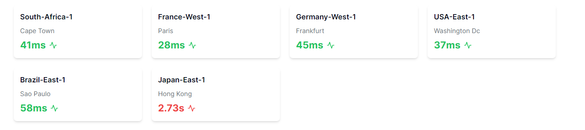

Some sweet perfomance 😆

⚠️ This is only for api routes.

## Getting Started

If you wanna run it locally:

```bash
npm run dev
# or
yarn dev
# or
pnpm dev
# or
bun dev
```

Open [http://localhost:3000](http://localhost:3000)

# Perfomance

You will see results corrected from servers around the world, average response time.

## Static api route


## Dynamic api route (`default`)


## Dynamic api route (`multi regions`)




⚠️ All above results might change in future so this is just bare minimum test in normal instance, no database considered or other factors.
